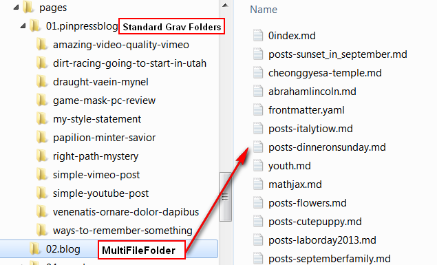

# Grav Multi-File-Folder Plugin

The **multifilefolder plugin** for [Grav](http://github.com/getgrav/grav) allows 
you to use folders that contain many markdown files, without having to create a subfolder for each page.

# Installation

Download the ZIP; Install like any other plugin.

# Configuration

Only enable option true/false.

## REQUIRES A HACK of 'Pages.php'

Sorry, not smart enough to do it without a hack. Change instances and children from protected to public! (ouch!)
~~~~
    /**
     * @var array|Page[]
     */
    //protected $instances;
    //jacmgr
    public $instances;
    /**
     * @var array|string[]
     */
    //protected $children;
    //jacmgr
    public $children;
~~~~

## CACHE

Turn system cache OFF in the system config as you install and try ot out. But, after you have your bugs worked out, then cache on; it works fine for me.

# Why

I have lots of personal sites that use markdown files in a structure of folders with many files in each folder, and each file with some custom name that suggests its contents.

I don't want to change all of that folder structure and especially each file name just to use GRAV.  I'd lose any backward compatibility, or ability to move away from grav later.

## Can you still use Grav pages?

Yes, mix and match.  Some pages using grav's rule of one file per folder system can be used simultaneously with the multifilifolder system.  Blends all the collections together, etc....

## Why Not

Well you do give up some of the Grav great stuff.
  
* Image storage location: I can't drop a pages associated images into the same folder as the markdown file.  I simply use a seperate image folder as described in the grav documentation.

* Can't use the ADMIN PANEL for managing these pages; except for the first page in the folder.  For me that is the 0index.md file which usually has the heavy frontmatter and so is noce in the ADMIN Panel. All the other files are just basic item type pages.  In any case, I prefer a front end page edit solution. Still looking for a good one, but my [plugin jacpageadmin](https://github.com/jacmgr/grav-plugin-jacpageadmin) works well enough for my needs.

* Tell me what breaks in the issues please..... 

# DEMO

For example; you can see it [on my test site](http://jhinline.com/grav/pin01/) with username: demouser and paswrd: DemoUser33

The folder structure is as shown up in the picture at the top of this page.  The pinpress sample blogs along side some of my blog pages.

